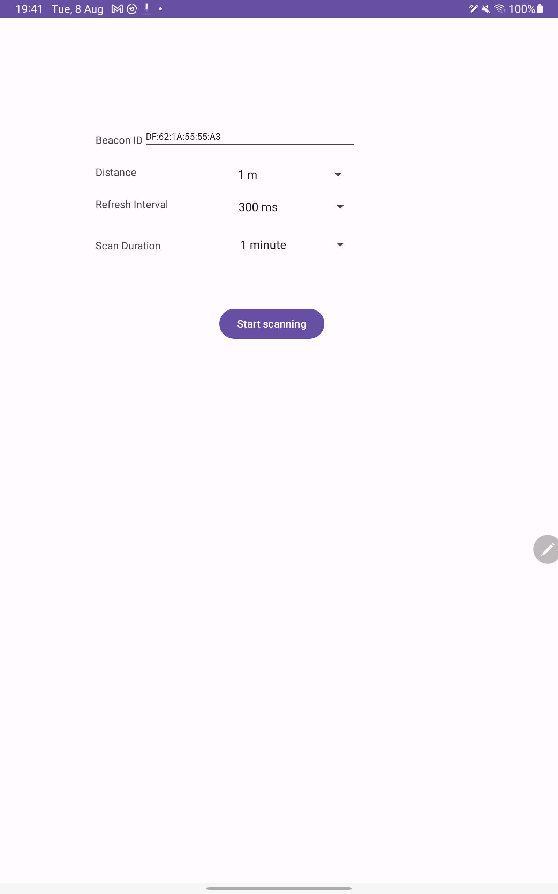
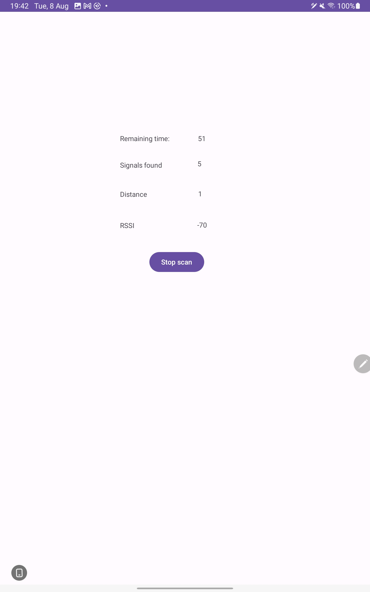
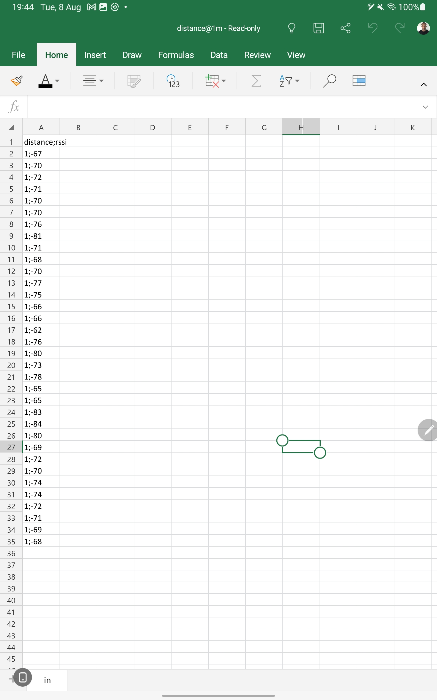

# RSSI Measurement Collector App

The RSSI Measurement Collector App is designed to facilitate the collection of Received Signal Strength Indication (RSSI) measurements from BLE beacons at a specified distance. This app is particularly useful for signal strength analysis, indoor positioning, and wireless network optimization.

## Requirements
JDK 17 or higher

## Preview

